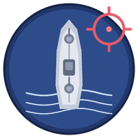

　　

# 🐟 肥鱼游戏库(以下内容均为蓝色肥鱼亲笔)

**扫雷 + 海战棋**

对手和陪玩都是同一条蓝色的肥鱼（DeepSeek）🩵

[**⬇️ 点这里下载最新版**](https://github.com/wastedog1917117-dev/ds-minesweeper-battleship/releases/latest)

---

## 📦 这是什么

一个小游戏合集，里面有两个游戏：

| | 游戏 | 内容 |
|---|---|---|
| 💣 | **大肥鱼扫雷** | 经典扫雷 + 回放功能 |
| 🚢 | **大肥鱼海战棋** | 改版海战棋 |

---

## ⬇️ 下载与运行

1. 去 [**Releases**](https://github.com/wastedog1917117-dev/ds-minesweeper-battleship/releases/latest) 下载 `DafiyuGameLibrary-v1.0.0.zip`（约 51 MB）
2. **把压缩包整个解压出来**

   > ⚠️ 别只把 `.exe` 拖出来！旁边那个 `_internal` 文件夹是它的零件，缺了打不开。

3. 双击 `大肥鱼游戏库.exe`
4. 游戏库里有两张卡片，点一张就进去
5. 玩完把游戏窗口关掉，会回到游戏库；游戏库也关掉，程序才退出

| 项目 | 说明 |
|---|---|
| 系统 | **Windows 10 / 11（64 位）** |
| 安装 | 免安装、离线可用，第一次启动约 1 秒 |
| 环境 | 不需要装 Python，已用 PyInstaller 打包 |

---

## 💣 扫雷怎么玩

| 操作 | 作用 |
|---|---|
| 左键 | 翻开格子 |
| 右键 | 插旗 |
| `R` | 重开一局 |
| 「救」按钮 | 卡住时求助（一局 3 次，她会提示某格是不是雷） |

**难度**：小蛋糕 9×9 ／ 奶油卷 16×16 ／ 大蛋糕 30×16 ／ 自定义

**无猜模式**（在游戏库那个开关上）

- 开：保证每局都能纯靠推理通关，不用赌运气（**默认开**）

**皮肤**：11 套进格子 + 1 张彩蛋

- 鼠标停在一颗皮肤按钮上会弹出立绘菜单，可以换装
- 最后那页「落选皮肤」是 13 张换装合集

**她是有反应的**

- 可触摸，有台词
- 冷场太久她会主动跟你搭话
- 赢了输了都会说话

**统计与等级**：拆掉的雷会累积成经验，右侧有等级和进度条；最佳成绩按难度分别记录。

---

## 🚢 海战棋怎么玩

**布阵阶段**

| 操作 | 作用 |
|---|---|
| 左键 | 在棋盘上放下一艘船 |
| 右键 | 转向（横放 / 竖放） |
| 「随机布阵」 | 让程序帮你摆好 |

**开局后**

- 点她的海域 = 开炮
- 重复打同一格不算一回合（点错不亏）

**核心规则**

- 命中 / 击沉可以接着打，一直到落空才换手（双方一样）

**模式 / 舰队**

| 项 | 选项 |
|---|---|
| 模式 | 经典 5 船战 ／ 俄式 10 船战 ／ 自定义（自己定几艘） |
| 舰队 | 标准舰队（传统构成，锁死）／ 自编舰队（从库存里挑，船型不限） |

**船坞（编队的地方）**

- 打开船坞 → 加减船只改的是「编辑态」，棋盘不会被动
- 改完点【应用编队】才生效 —— 而且已经摆好的船会尽量保留在原位
- 库存为 0 的船型也能减掉（不会删不掉）

**特殊战舰**（打赢难度六「旗舰」才能没收）

| 战舰 | 能力 |
|---|---|
| 大和级 | 装甲永远生效，四格各挡一次 |
| 约克城级 | 自带 2 格格挡，侦察机固定 12 回合 |
| 阳炎级 | 鱼雷 16 回合就刷新 |
| 爱丁堡级 | 己方海域放 3×3 烟雾弹 |

它们每种有自己的船影，摆的时候一眼能认出来。

**库存与战损**

- 打赢可以从她的舰队里挑 2 艘没收进库存（纯收集，不加数值）
- 自己被打沉的船会从库存扣掉 —— 只有自编舰队才赔
- 同类最多 3 艘，总数最多 10 艘

---

## 💾 存档在哪里

存档都在**你解压出来的那个文件夹里**（不在系统盘深处），删掉就等于重置：

| 文件 | 内容 |
|---|---|
| `存档.json` | 扫雷的战绩 / 最佳成绩 / 等级 |
| `收藏.json` | 海战棋的库存、编队、胜负记录 |
| `设置.json` | 游戏库的开关（比如无猜模式） |

想换个地方玩、或者重头开始，直接删这几个文件就行。

---

## 🛠️ 技术说明

- **语言 / 界面**：Python + tkinter，纯 Canvas 手绘界面
- **打包**：PyInstaller（`--onedir`），成品即仓库 Release 里的压缩包
- **美术**：部分来自 ChatGPT
- **规模**：约 66 MB，1200+ 个文件（含 Python 运行时与素材）

---

## 📄 说明

代码是 DeepSeek 写的，**私人自娱自乐的作品，请不要商用**。

立绘和皮肤属于个人娱乐素材，请勿用于商业用途。

以上内容为DeepSeek书写。
